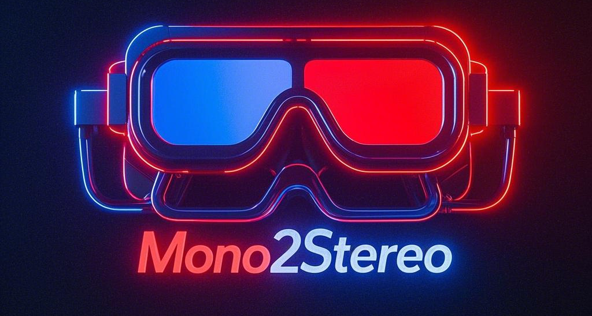
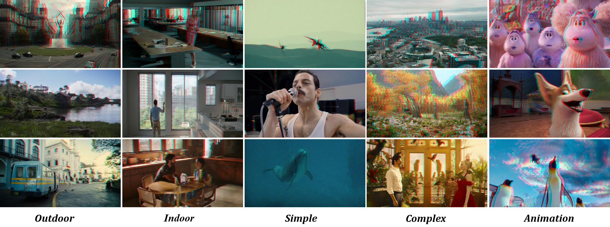
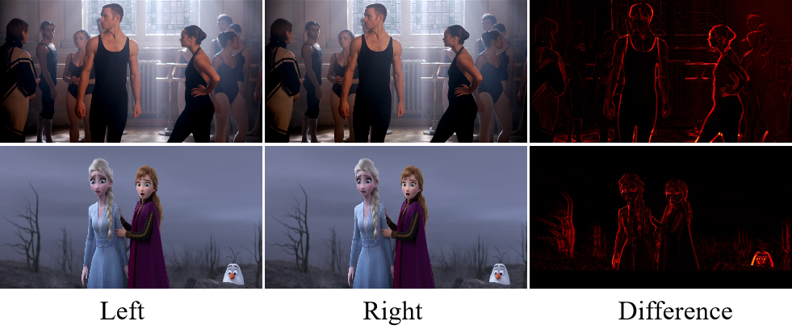

  
<h1> Mono2Stereo: A Benchmark and Empirical Study for Stereo Conversion </h1>
  &nbsp;
  &nbsp;

<a href="https://song2yu.github.io/">1Songsong Yu</a> |
<a href="https://scholar.google.com/citations?hl=zh-CN&user=dEm4OKAAAAAJ&view_op=list_works">2 Yuxin Chen</a> |
<a href="https://scholar.google.com/citations?user=ysXmZCMAAAAJ&hl=zh-CN&oi=ao">3Zeke Xie</a> |
<a href="https://scholar.google.com/citations?user=j1XFhSoAAAAJ&hl=zh-CN&oi=ao">1Yifan Wang</a> |
<a href="https://scholar.google.com/citations?user=EfTwkXMolscC&hl=zh-CN&oi=ao">1Lijun Wang</a> |
<a href="https://scholar.google.com/citations?user=zJvrrusAAAAJ&hl=zh-CN&oi=ao">2Zhongang Qi</a> |
<a href="https://scholar.google.com/citations?user=4oXBp9UAAAAJ&hl=zh-CN&oi=ao">2Ying Shan</a> |
<a href="https://scholar.google.com/citations?user=D3nE0agAAAAJ&hl=zh-CN&oi=ao">1Huchuan Lu</a>
  
1Dalian University of Technology 
2ARC Lab, Tencent PCG
3The Hong Kong University of Science and Technology (Guangzhou)

CVPR 2025

<h2>
 Brief introduction
</h2>
  
 

<strong> Abstract.</strong> With the rapid proliferation of 3D devices and the shortage of 3D content, stereo conversion is attracting increasing attention. Recent works introduce pretrained Diffusion Models (DMs) into this task. However, due to the scarcity of large-scale training data and comprehensive benchmarks, the optimal methodologies for employing DMs in stereo conversion and the accurate evaluation of stereo effects remain largely unexplored. In this work, we introduce the Mono2Stereo dataset, providing high-quality training data and benchmark to support in-depth exploration of stereo conversion. With this dataset, we conduct an empirical study that yields two primary findings. 1) The differences between the left and right views are subtle, yet existing metrics consider overall pixels, failing to concentrate on regions critical to stereo effects. 2) Mainstream methods adopt either one-stage left-to-right generation or warp-and-inpaint pipeline, facing challenges of degraded stereo effect and image distortion respectively. Based on these findings, we introduce a new evaluation metric, Stereo Intersection-over-Union, which prioritizes disparity and achieves a high correlation with human judgments on stereo effect. Moreover, we propose a strong baseline model, harmonizing the stereo effect and image quality simultaneously, and notably surpassing current mainstream methods. Our code and data will be open-sourced to promote further research in stereo conversion.
   

 

  
 <strong> Datasets.</strong> We collect approximately two million stereo image pairs for model training and provide the code for data processing.
   

 <strong> Architecture.</strong> We find that due to the small differences between the left and right images, the model tends to degenerate into an identity mapping during training. Therefore, we add an edge consistency loss to force the model to focus on edge information.
   

 <strong> SIoU.</strong> We find that due to the small differences between the left and right images, the model tends to degenerate into an identity mapping during training. Therefore, we add an edge consistency loss to force the model to focus on edge information.
   

<h2>
Visual Effects
</h2>
  
 

<h2>
BibTeX
</h2>
  
 

  

    here is a statement.
  

<h2>
Acknowledgements
</h2>
  
 

 

Website adapted from the following <a href="https://github.com/CaiJimmy/hugo-theme-stack-starter">template</a>.

