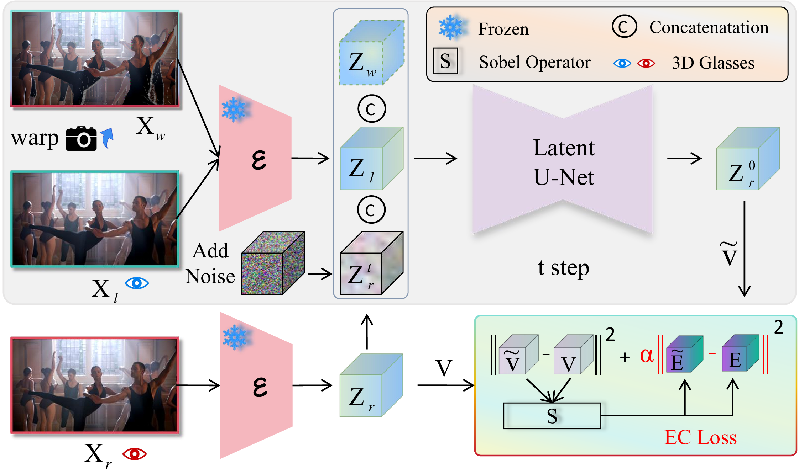
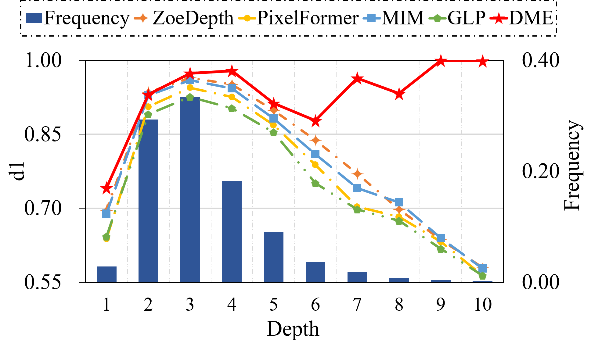
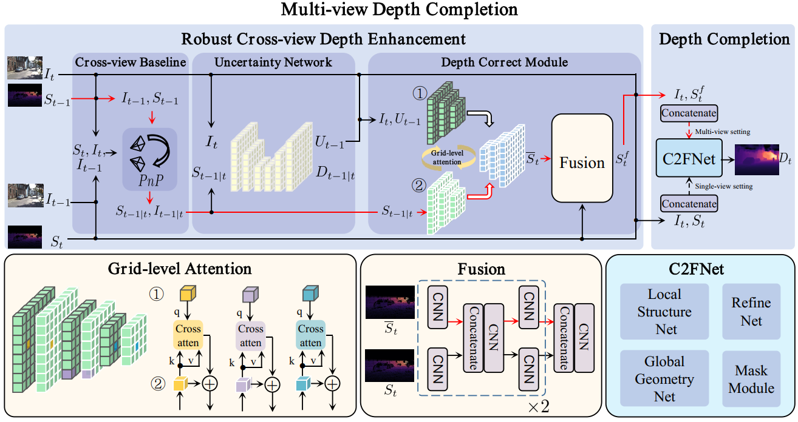
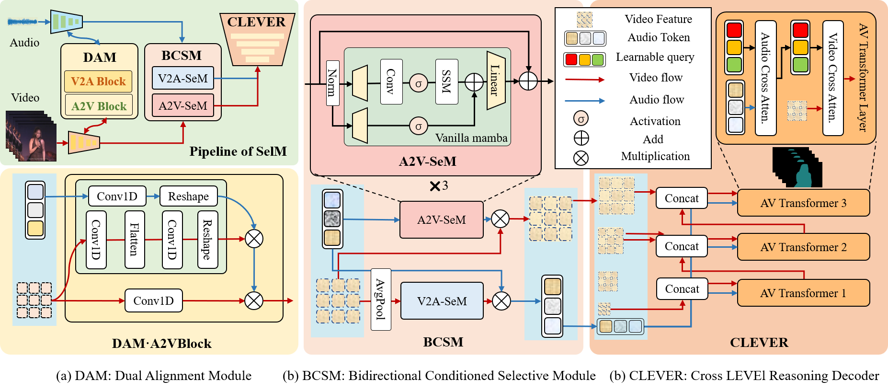

<h2> Mono2Stereo: A Benchmark and Empirical Study for Stereo Conversion </h2>
  &nbsp;
  &nbsp;

<a href="https://song2yu.github.io/">1Songsong Yu</a> |
<a href="https://scholar.google.com/citations?hl=zh-CN&user=dEm4OKAAAAAJ&view_op=list_works">2 Yuxin Chen</a> |
<a href="https://scholar.google.com/citations?user=ysXmZCMAAAAJ&hl=zh-CN&oi=ao">3Zeke Xie</a> |
<a href="https://scholar.google.com/citations?user=j1XFhSoAAAAJ&hl=zh-CN&oi=ao">1Yifan Wang</a> |
<a href="https://scholar.google.com/citations?user=EfTwkXMolscC&hl=zh-CN&oi=ao">1Lijun Wang</a> |
<a href="https://scholar.google.com/citations?user=zJvrrusAAAAJ&hl=zh-CN&oi=ao">2Zhongang Qi</a> |
<a href="https://scholar.google.com/citations?user=4oXBp9UAAAAJ&hl=zh-CN&oi=ao">2Ying Shan</a> |
<a href="https://scholar.google.com/citations?user=D3nE0agAAAAJ&hl=zh-CN&oi=ao">1Huchuan Lu</a>
  
1Dalian University of Technology 
2ARC Lab, Tencent PCG
3The Hong Kong University of Science and Technology (Guangzhou)

CVPR 2025

<h2>
 Brief introduction
</h2>

<strong> Abstract.</strong> With the rapid proliferation of 3D devices and the shortage of 3D content, stereo conversion is attracting increasing attention. Recent works introduce pretrained Diffusion Models (DMs) into this task. However, due to the scarcity of large-scale training data and comprehensive benchmarks, the optimal methodologies for employing DMs in stereo conversion and the accurate evaluation of stereo effects remain largely unexplored. In this work, we introduce the Mono2Stereo dataset, providing high-quality training data and benchmark to support in-depth exploration of stereo conversion. With this dataset, we conduct an empirical study that yields two primary findings. 1) The differences between the left and right views are subtle, yet existing metrics consider overall pixels, failing to concentrate on regions critical to stereo effects. 2) Mainstream methods adopt either one-stage left-to-right generation or warp-and-inpaint pipeline, facing challenges of degraded stereo effect and image distortion respectively. Based on these findings, we introduce a new evaluation metric, Stereo Intersection-over-Union, which prioritizes disparity and achieves a high correlation with human judgments on stereo effect. Moreover, we propose a strong baseline model, harmonizing the stereo effect and image quality simultaneously, and notably surpassing current mainstream methods. Our code and data will be open-sourced to promote further research in stereo conversion.

<i class="fas fa-envelope"></i>1: 22209083@mail.dlut.edu.cn(primary)

<i class="fas fa-envelope"></i>2: 1195653686@qq.com

<i class="fas fa-envelope"></i>3: SongsongYu203@163.com

    
    
 

## About Me

    
    
        
    </a>

I am a second-year postgraduate student in the School of Information and Communication Engineering at Dalian University of Technology, under the supervision of Prof. [Huchuan Lu](https://scholar.google.com/citations?user=D3nE0agAAAAJ&hl=zh-CN&oi=ao) and Prof. [Lijun Wang](https://scholar.google.com/citations?user=EfTwkXMolscC&hl=zh-CN&oi=ao) from IIAU-Lab. 

During my undergraduate studies, I studied subjects such as control principles, communication principles, and image processing. I was honored to be guided by professors like [Shuai Liu](https://scholar.google.com/citations?hl=zh-CN&user=IECCPKUAAAAJ&view_op=list_works), [Shuaishuai Guo](https://scholar.google.com/citations?user=D_kCy_QAAAAJ&hl=zh-CN&oi=ao), and [Ran Song](https://ieeexplore.ieee.org/author/37546859100).

Currently, my research focuses on **Depth Estimation** and **Audio-Visual Video Segmentation**. I also have a keen interest in **diffusion models**, **multimodal tasks**, and **3D Scene Understanding**.

I am interning at ARC LAB, Tencent PCG.

## News

[2024/07/21] One Paper named "SelM" (<strong>Oral 3.97%</strong>) has been accepted by ACM MM 2024.

[2023/12/09] My first single-first-author paper <a href="https://ojs.aaai.org/index.php/AAAI/article/view/28506">DME</a> has been accepted by AAAI 2024! Official Debut!

[2022/09/21] I'm joining <a href="https://futureschool.dlut.edu.cn/IIAU.htm">IIAU-Lab</a> at <a href="https://www.dlut.edu.cn">DLUT</a> as postgraduate student.

[2022/06/21] I have graduated from <a href="https://www.sdu.edu.cn">Shandong University</a> today.

## Education

#### Dalian University of Technology, Dalian, China (Sep. 2022 - Now)

Postgraduate student of Engineering in Eletronic Information Engineering

Major Orientation: Depth Estimation and Audio-Visual Video Segmentation

Overall GPA: 4.37/5.0

#### Shandong University, Jinan, China (Sep. 2018 - Jul. 2022)

Bachelor of School of Control Science and Engineering

Overall GPA: 3.87/5.0 (Recommended postgraduate)

## Publications

**Mono2Stereo: A Benchmark and Empirical Study for Stereo Conversion**

**Songsong Yu**, Yuxin Chen, Zeke Xie, Yifan Wang, Lijun Wang, Zhongang Qi, YingShan, Huchuan Lu

**Accepted by** IEEE Conference on Computer Vision and Pattern Recognition(**CVPR**) 2025

[Paper and Code are Comming soon]

 

**DME: Unveiling the Bias for Better Generalized Monocular Depth Estimation**

**Songsong Yu**, Yifan Wang, Yunzhi Zhuge, Lijun Wang, Huchuan Lu

**Accepted by** Association for the Advancement of Artificial Intelligence(**AAAI**) 2024

[[Paper](https://ojs.aaai.org/index.php/AAAI/article/view/28506)][[Code](https://github.com/YUsong360/DME-Unveilingthe-bias)]

**Multi-View Depth Completion with Coarse-to-Fine Networks**

**Songsong Yu†**, Haiting Wang†, Jiajun Li, Yifan Wang, Lijun Wang, Huchuan Lu (†equal contribution)

**Submitted to** Asian Conference on Computer Vision (**ACCV**) 2024

[[Paper](https://papers.ssrn.com/sol3/papers.cfm?abstract_id=4732434)]

**SelM: Selective Mechanism based Audio-Visual Segmentation**

Jiajun Li†, **Songsong Yu†**, Yifan Wang, Lijun Wang, Huchuan Lu (†equal contribution)

**Accepted by** ACM Multimedia(**ACM MM**) 2024 **Oral 3.97%**

[[Paper]()]

## Miscellaneous
<link rel="stylesheet" href="https://cdnjs.cloudflare.com/ajax/libs/font-awesome/5.15.4/css/all.min.css">
<i class="fas fa-square fa-xs"></i>[3 yrs +] <i class="fas fa-guitar"></i>  I have a passion for Rock and folk music. My favorite music bands include Wei Xu, The Beatles, Coldplay, and Queen.

<i class="fas fa-square fa-xs"></i>[4 yrs +] <i class="fas fa-dumbbell"></i>  I enjoy running and exercising, and I achieved second place in the 3Km men's group at college.

<i class="fas fa-square fa-xs"></i>[6 yrs +] <i class="fas fa-book"></i>  Reading is one of my favorite pastimes, and I particularly admire writers such as Xiaobo Wang, Han Han, among others.

